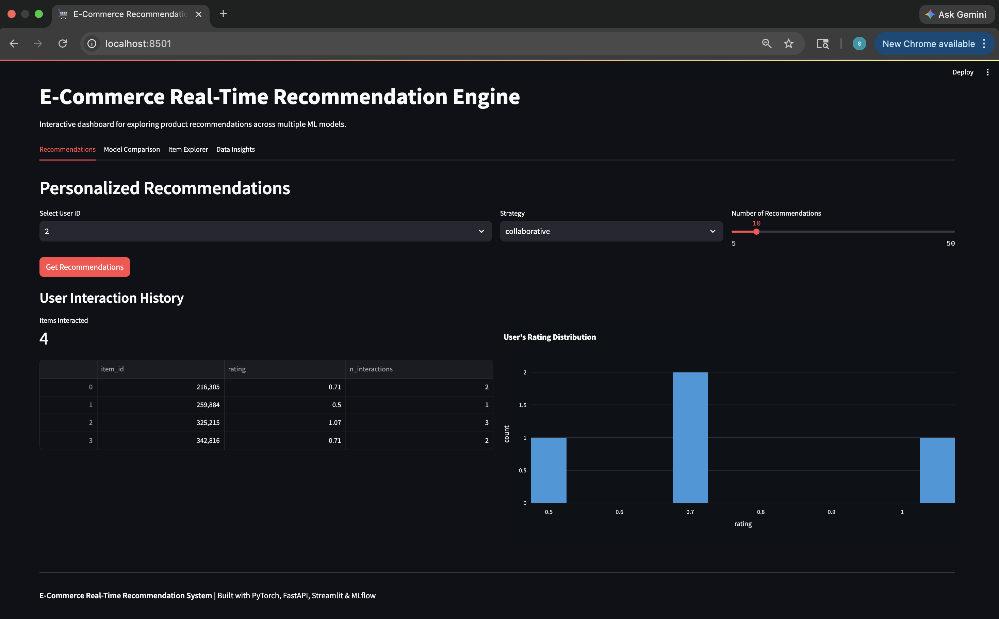
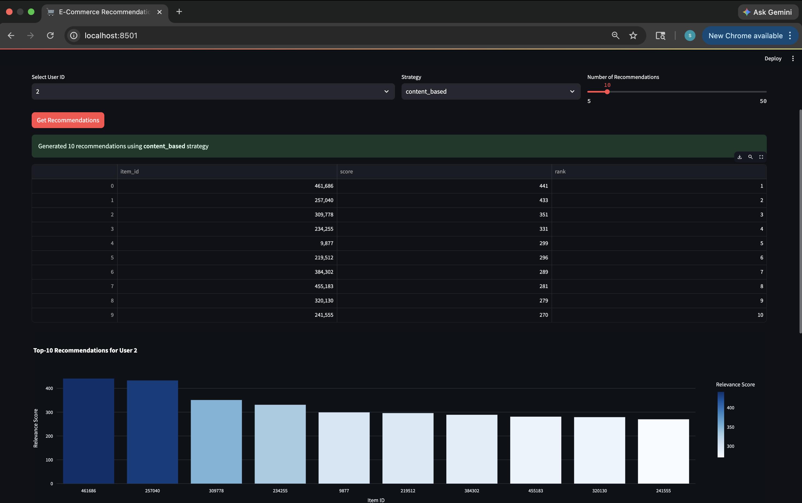
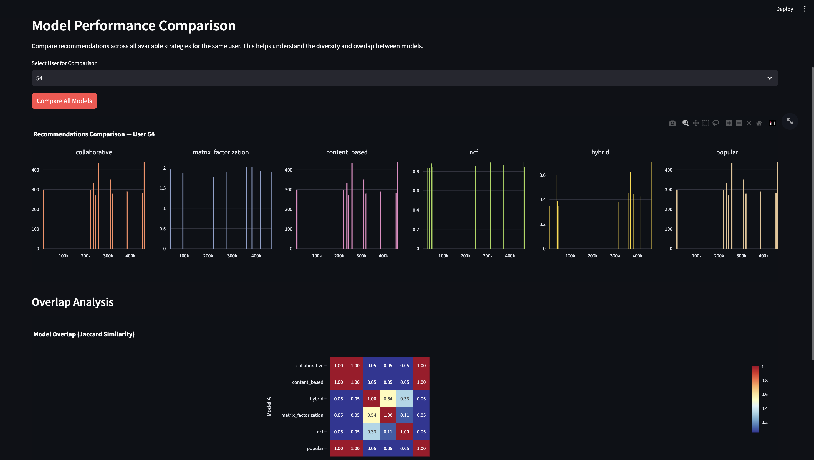
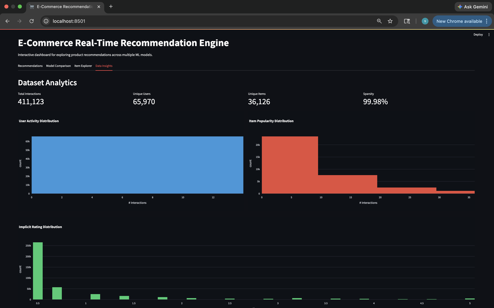

# E-Commerce Real-Time Recommendation System

An end-to-end product recommendation engine built on the **Retail Rocket** e-commerce dataset, implementing multiple recommendation strategies with real-time serving, experiment tracking, and an interactive dashboard.

## Screenshots

### Dashboard — Personalized Recommendations & User History


### Top-10 Recommendations with Relevance Scores


### Model Performance Comparison & Overlap Analysis


### Dataset Analytics (411K interactions, 65K users, 36K items, 99.98% sparsity)


## Architecture

```
┌──────────────────┐     ┌──────────────────┐     ┌──────────────────┐
│   Raw Events     │────▶│  Feature Engine   │────▶│  Model Training  │
│  (view/cart/buy) │     │  (user, item,     │     │  (CF, SVD, NCF,  │
│                  │     │   session feats)  │     │   content, hybrid)│
└──────────────────┘     └──────────────────┘     └────────┬─────────┘
                                                           │
                              ┌─────────────────────────────┤
                              ▼                             ▼
                    ┌──────────────────┐          ┌──────────────────┐
                    │   FastAPI        │          │   MLflow         │
                    │   Real-Time API  │          │   Experiment     │
                    │   /recommend     │          │   Tracking       │
                    └────────┬─────────┘          └──────────────────┘
                             │
                             ▼
                    ┌──────────────────┐
                    │   Streamlit      │
                    │   Dashboard      │
                    └──────────────────┘
```

## Models Implemented

| Model | Approach | Key Technique |
|-------|----------|---------------|
| **Collaborative Filtering** | Item-based KNN | Cosine similarity on interaction matrix |
| **Matrix Factorization** | SVD | Latent factor decomposition (Surprise) |
| **Content-Based** | Item features | Category/property similarity with TF-IDF |
| **Neural CF (NCF)** | Deep Learning | GMF + MLP dual pathway (PyTorch) |
| **Hybrid Ensemble** | Weighted fusion | Normalized score combination |

## Evaluation Metrics

- **Precision@K**, **Recall@K** — Retrieval accuracy
- **NDCG@K** — Ranking quality (position-aware)
- **MAP@K** — Mean average precision
- **Hit Rate@K** — Fraction of users with at least one relevant recommendation
- **Coverage** — Catalog coverage of recommendations
- **Diversity** — Pairwise dissimilarity across recommendation lists
- **Novelty** — Self-information of recommended items

## Project Structure

```
├── api/
│   ├── app.py                 # FastAPI real-time serving
│   └── schemas.py             # Request/response models
├── configs/
│   └── config.yaml            # Hyperparameters & settings
├── dashboard/
│   └── app.py                 # Streamlit interactive dashboard
├── data/
│   ├── raw/                   # Retail Rocket CSVs (download separately)
│   └── processed/             # Parquet files (generated)
├── notebooks/
│   ├── 01_EDA.ipynb           # Exploratory data analysis
│   ├── 02_preprocessing.ipynb # Data pipeline & feature engineering
│   ├── 03_model_training.ipynb# Model training with MLflow
│   └── 04_evaluation.ipynb    # Deep evaluation & A/B test simulation
├── src/
│   ├── data_loader.py         # Data ingestion & preprocessing
│   ├── feature_engine.py      # Feature engineering pipeline
│   ├── evaluation.py          # Recommendation metrics
│   ├── recommender.py         # Unified recommendation interface
│   ├── utils.py               # Helper functions
│   └── models/
│       ├── collaborative.py   # KNN collaborative filtering
│       ├── matrix_factor.py   # SVD matrix factorization
│       ├── content_based.py   # Content-based filtering
│       ├── ncf.py             # Neural Collaborative Filtering (PyTorch)
│       └── hybrid.py          # Hybrid ensemble
├── tests/
│   └── test_models.py         # Unit tests
├── Dockerfile
├── requirements.txt
└── README.md
```

## Quick Start

### 1. Setup

```bash
git clone https://github.com/SindhuKotte/Real-Time-Recommendation-System.git
cd Real-Time-Recommendation-System

python -m venv venv
source venv/bin/activate  # On Windows: venv\Scripts\activate

pip install -r requirements.txt
```

### 2. Download Dataset

Download the [Retail Rocket dataset](https://www.kaggle.com/datasets/retailrocket/ecommerce-dataset) from Kaggle and place the CSV files in `data/raw/`:

```
data/raw/
├── events.csv
├── item_properties_part1.csv
├── item_properties_part2.csv
└── category_tree.csv
```

### 3. Run Notebooks (Recommended Order)

```bash
jupyter notebook
```

1. **01_EDA.ipynb** — Explore the dataset
2. **02_preprocessing.ipynb** — Run data pipeline & feature engineering
3. **03_model_training.ipynb** — Train all models with MLflow tracking
4. **04_evaluation.ipynb** — Deep evaluation, cold-start analysis, A/B simulation

### 4. Launch MLflow UI

```bash
mlflow ui --backend-store-uri mlruns
```

Open http://localhost:5000 to compare experiments.

### 5. Start API Server

```bash
uvicorn api.app:app --host 0.0.0.0 --port 8000 --reload
```

Open http://localhost:8000/docs for interactive API documentation.

**Example API call:**
```bash
curl -X POST "http://localhost:8000/recommend" \
  -H "Content-Type: application/json" \
  -d '{"user_id": 123456, "top_n": 10, "strategy": "hybrid"}'
```

### 6. Launch Dashboard

```bash
streamlit run dashboard/app.py
```

Open http://localhost:8501 for the interactive dashboard.

### 7. Docker

```bash
docker build -t recommendation-engine .
docker run -p 8000:8000 recommendation-engine
```

## Tech Stack

- **Core ML**: NumPy, Pandas, Scikit-learn, Surprise
- **Deep Learning**: PyTorch (Neural Collaborative Filtering)
- **API**: FastAPI + Uvicorn
- **Dashboard**: Streamlit + Plotly
- **Experiment Tracking**: MLflow
- **Containerization**: Docker

## Key Design Decisions

1. **Temporal train/test split** — Prevents data leakage by splitting on time, mimicking real-world deployment
2. **Implicit feedback** — Converts behavioral events (view/cart/purchase) to weighted scores rather than explicit ratings
3. **Negative sampling** — NCF uses 4:1 negative-to-positive ratio for learning from implicit data
4. **Hybrid normalization** — Min-max normalizes scores before weighted fusion to handle different model score scales
5. **Cold-start fallback** — Gracefully degrades to popularity-based recommendations for unknown users

## License

MIT
